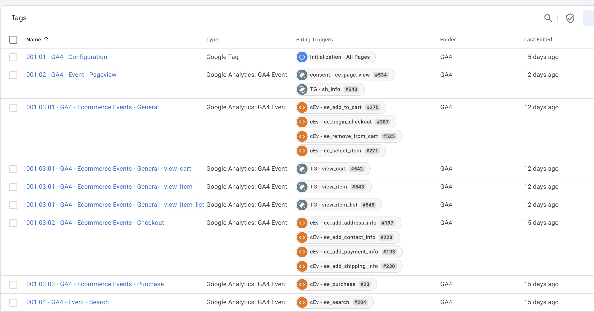

# 🏷️ TagSight – GTM Debugger & Enhancer

**TagSight** is a developer-friendly Chrome Extension that expands the capabilities of the Google Tag Manager (GTM) interface.  



It's designed to help data analysts, tag managers, and technical marketers **visually debug, track, and better understand** how triggers, tags, and groups behave.

---

## 🚀 Features

- ✅ Adds trigger IDs directly next to trigger chips in the GTM UI.
- ✅ Visually highlights expanded trigger group items with matching trigger IDs.
- ✅ Allows for easier debugging of complex tag-trigger relationships.
- ✅ Built for single-page navigation inside GTM (MutationObserver-powered).
- ✅ Lightweight, secure, and does not affect GTM functionality.

---

## 🎯 Purpose

Google Tag Manager is powerful—but navigating triggers and groups can be tedious.  
**TagSight** gives you immediate visibility into what's connected to what, **boosting your confidence when debugging or configuring advanced tag setups**.

---

## 📦 Installation (Dev Mode)

1. Clone or download this repo.
2. Go to `chrome://extensions` in Chrome.
3. Enable **Developer Mode**.
4. Click **"Load unpacked"** and select the project folder.
5. Navigate to [Google Tag Manager](https://tagmanager.google.com) → Enjoy enhanced clarity!

---

## 📁 Project Structure
```
tagsight-gtm-debugger/
├── manifest.json
├── content.js
└── README.md
```

---

## 📜 License

MIT — use it, modify it, share it.

---

## 🤝 Contribute

PRs are welcome.  
You can help expand features like:

- Tooltip explanations
- Trigger group visual mapping
- JSON data export of triggers/tags
